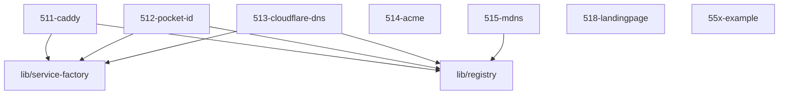

# LLM Wiki: `51-ingress`

> **Zweck:** Ingress & Edge Domain — Caddy-Routing (511), OIDC-IdP (512),
> DDNS-Anker (513), ACME/TLS (514), mDNS (515), Landingpage (518).
> Wie ein Dienst hier andockt: siehe README.md / 510-ingress-SERVICE.md.

<!-- AUTO-GENERATED, DO NOT EDIT BELOW -->

## Module Map

| ID | Modul-Datei | Status | Komplexitaet | Ports |
|---|---|---|---|---|
| `511-caddy` | `511-caddy.nix` | active | -/5 | - |
| `512-pocket-id` | `512-pocket-id.nix` | active | 4/5 |  |
| `513-cloudflare-dns` | `513-cloudflare-dns.nix` | active | -/5 | - |
| `514-acme` | `514-acme.nix` | active | -/5 | - |
| `515-mdns` | `515-mdns.nix` | active | 3/5 | - |
| `518-landingpage` | `518-landingpage.nix` | unknown | -/5 | - |
| `55x-example` | `55x-example.nix` | template | -/5 | - |

## Interne Abhaengigkeiten (Requires)

Die Module in diesem Ordner benoetigen folgende Bibliotheken/Dateien:

- `lib/registry`
- `lib/service-factory`

## Dependency Graph

---
*Generiert durch `medinix-meta.py generate-docs`*
