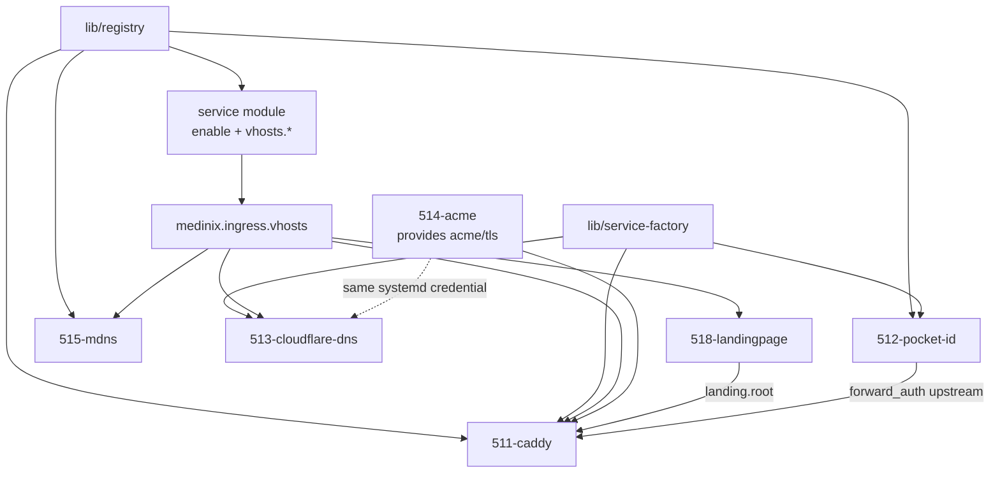

# 51-ingress: Ingress & Edge Domain

The **Ingress Domain** is the front door of mediNix-core: routing, TLS termination, DNS anchors, mDNS, and OIDC. It does **not** own individual applications.

How-to: [`510-ingress-SERVICE.md`](510-ingress-SERVICE.md)

> **A service describes itself. Ingress organs only consume that description.**

No program *logic* belongs in 511, 513, 515, or 518 — the auth-upstream coupling is data-driven via `lib/registry.nix` (ADR-5120 contract: 511 targets `127.0.0.1:<pocket-id-port>`). Seerr knowledge lives in `555-seerr.nix`. A new service is a new module plus a vhost registration — never an edit to the landing page, the DNS pruner, or the Caddy engine.

## How a service joins the edge

```nix
lib.mkIf cfg.enable {
  medinix.ingress.vhosts."seerr" = {
    accessGroup = reg.caddyClass;   # stream | internal | public | idp | none
    landing     = true;
    iconSvg     = ''<svg xmlns="http://www.w3.org/2000/svg" viewBox="0 0 96 96">…</svg>'';
  };
}
```

| Field | Who sets it | Who reads it |
| --- | --- | --- |
| `cfg.enable` | service module | systemd unit in that same file |
| `ingress.vhosts.<name>` | service module | 511, 513, 515, 518 |
| `accessGroup` | service module | 511 templates |
| `landing = true` | service module | 518 (tile or not) |
| `iconSvg` | service module | 518 |
| `dns.hostnames.<name>` | host / DNS options | 511 + 518 public URL, 513 prune alias |

## Dependency graph

Two layers.

**Compile-time (`requires` / `provides` in the module headers).**  
`python 50-core/medinix-meta.py generate-docs` turns those lists into [`AGENTS.md`](AGENTS.md). Today the headers mostly name *libraries*:

| Module header | `requires` | `provides` |
| --- | --- | --- |
| 511-caddy | `lib/service-factory`, `lib/registry` | routing (engine) |
| 512-pocket-id | `lib/service-factory`, `lib/registry` | `pocket-id`, `oidc` |
| 513-cloudflare-dns | `lib/service-factory` | `ddns`, `cloudflare` |
| 514-acme | — | `acme`, `tls`, `certificates` |
| 515-mdns | `lib/registry` | mDNS aliases |
| 518-landingpage | `511-caddy` | `landing-html` |

That is why the generated mermaid looks like 511/512 → factory/registry and 518 → 511. Sibling organs are **not** wired in `requires` on purpose: 511 does not import 514 as a Nix module; it reads files 514 wrote. To make AGENTS.md show 511 → 514, put `514-acme` into 511's `requires:` and re-run `generate-docs`. Do not hand-edit the block below `AUTO-GENERATED` in AGENTS.md.

**Runtime contract (what actually flows at eval/boot):**



| Module | Allowed to know | Forbidden |
| --- | --- | --- |
| **511** | vhosts, accessGroup, domain, TLS files, auth mode | program names, icons, DNS writes, Avahi policy |
| **512** | Pocket ID process + `vhosts."pocket-id"` | Caddyfile, ACME, DNS |
| **513** | `attrNames vhosts` + `dns.hostnames` values | `feishin`, `jellyfin`, any second inventory |
| **514** | `acmeHost`, systemd credential | Caddy ACME, HTTP-01, `tokenFile` |
| **515** | vhost names + `home` when landing is on | Caddy, TLS, HTML |
| **518** | `landing`, `iconSvg`, public host | preferred lists, icon maps, `/go/*`, JS, Caddy |

Chameleon (511 only): `auto` reads `services.caddy.enable`; `global` injects `virtualHosts`; `standalone` runs `caddy-media`. One `allSites` list.

## Addresses

```
https://{name}.{domain}     Lego wildcard (514), policy from accessGroup
http://{name}.{domain}      301 → HTTPS when TLS is on
http://{name}.local         HTTP only; no TLS, no auth, no WAN abort
https://{domain}            landing (LAN abort)
http://home.local           same HTML, HTTP
```

## Dezimalrahmen

| ID | File | Role |
| --- | --- | --- |
| **510** | `510-ingress-SERVICE.md` | How-to. Not a Nix module. |
| **511** | `511-caddy.nix` · ADR-5110 | Chameleon Caddy. Stock package, `auto_https off`. |
| **512** | `512-pocket-id.nix` · ADR-5120 | OIDC on `127.0.0.1:5120`. Explicit enable. |
| **513** | `513-cloudflare-dns.nix` · ADR-5130 | Anchor DDNS. Dumb prune of vhost names. |
| **514** | `514-acme.nix` · ADR-5140 | Wildcard DNS-01. Group `caddy`. |
| **515** | `515-mdns.nix` · ADR-5150 | Sole Avahi owner. |
| **518** | `518-landingpage.nix` · ADR-5180 | `ingress.landing.root` only. 511 serves it. |

## Closed vs open

Closed: 511 P0/`publicNames`, forward-auth contract, 512 explicit enable, 513 dump prune, 514 systemd-credentials only, 518 generic tiles.

Open: 515 name-set still filters on registry ports; 554-feishin bypasses 511; `nix flake check` / `caddy validate`.
