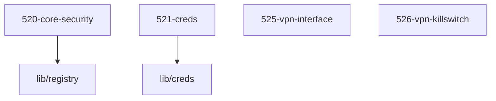

# LLM Wiki: `52-security`

> **Zweck:** [BITTE MANUELL AUSFUELLEN: Wofuer ist dieser Ordner zustaendig?]

<!-- AUTO-GENERATED, DO NOT EDIT BELOW -->

## Module Map

| ID | Modul-Datei | Status | Komplexitaet | Ports |
|---|---|---|---|---|
| `520-core-security` | `520-core-security.nix` | active | 3/5 | - |
| `521-creds` | `521-creds.nix` | active | -/5 | - |
| `525-vpn-interface` | `525-vpn-interface.nix` | active | 4/5 | - |
| `526-vpn-killswitch` | `526-vpn-killswitch.nix` | active | 5/5 | - |

## Interne Abhaengigkeiten (Requires)

Die Module in diesem Ordner benoetigen folgende Bibliotheken/Dateien:

- `lib/creds`
- `lib/registry`

## Dependency Graph

---
*Generiert durch `medinix-meta.py generate-docs`*
