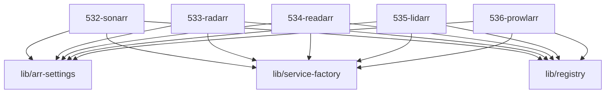

# LLM Wiki: `53-acquisition`

> **Zweck:** [BITTE MANUELL AUSFUELLEN: Wofuer ist dieser Ordner zustaendig?]

<!-- AUTO-GENERATED, DO NOT EDIT BELOW -->

## Module Map

| ID | Modul-Datei | Status | Komplexitaet | Ports |
|---|---|---|---|---|
| `532-sonarr` | `532-sonarr.nix` | active | 3/5 | - |
| `533-radarr` | `533-radarr.nix` | active | 3/5 | - |
| `534-readarr` | `534-readarr.nix` | retired | 3/5 | - |
| `535-lidarr` | `535-lidarr.nix` | active | 3/5 | - |
| `536-prowlarr` | `536-prowlarr.nix` | active | 3/5 | - |

## Interne Abhaengigkeiten (Requires)

Die Module in diesem Ordner benoetigen folgende Bibliotheken/Dateien:

- `lib/arr-settings`
- `lib/registry`
- `lib/service-factory`

## Dependency Graph

---
*Generiert durch `medinix-meta.py generate-docs`*
