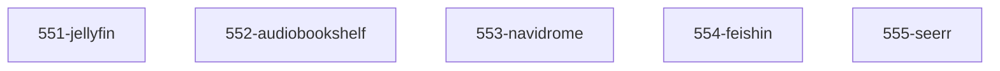

# LLM Wiki: `55-playback`

> **Zweck:** [BITTE MANUELL AUSFUELLEN: Wofuer ist dieser Ordner zustaendig?]

<!-- AUTO-GENERATED, DO NOT EDIT BELOW -->

## Module Map

| ID | Modul-Datei | Status | Komplexitaet | Ports |
|---|---|---|---|---|
| `551-jellyfin` | `551-jellyfin.nix` | unknown | -/5 | - |
| `552-audiobookshelf` | `552-audiobookshelf.nix` | unknown | -/5 | - |
| `553-navidrome` | `553-navidrome.nix` | unknown | -/5 | - |
| `554-feishin` | `554-feishin.nix` | unknown | -/5 | - |
| `555-seerr` | `555-seerr.nix` | unknown | -/5 | - |

## Interne Abhaengigkeiten (Requires)

Die Module in diesem Ordner benoetigen folgende Bibliotheken/Dateien:

## Dependency Graph

---
*Generiert durch `medinix-meta.py generate-docs`*
