# LLM Wiki: `57-maintenance`

> **Zweck:** [BITTE MANUELL AUSFUELLEN: Wofuer ist dieser Ordner zustaendig?]

<!-- AUTO-GENERATED, DO NOT EDIT BELOW -->

## Module Map

| ID | Modul-Datei | Status | Komplexitaet | Ports |
|---|---|---|---|---|
| `570-storage` | `570-storage.nix` | active | 4/5 | - |
| `571-sqlite-wal` | `571-sqlite-wal.nix` | active | 3/5 | - |
| `572-recyclarr` | `572-recyclarr.nix` | active | 3/5 | - |
| `573-exportarr` | `573-exportarr.nix` | active | 4/5 | - |
| `574-provisioning` | `574-provisioning.nix` | unknown | -/5 | - |
| `575-update-notifier` | `575-update-notifier.nix` | active | 3/5 | - |
| `576-backup` | `576-backup.nix` | active | -/5 | - |
| `577-drift-detection` | `577-drift-detection.nix` | active | 3/5 | - |
| `578-orphan-cleanup` | `578-orphan-cleanup.nix` | active | 3/5 | - |
| `579-backup-ssh` | `579-backup-ssh.nix` | active | -/5 | - |

## Interne Abhaengigkeiten (Requires)

Die Module in diesem Ordner benoetigen folgende Bibliotheken/Dateien:

- `lib/hardening-profiles`
- `lib/registry`

## Dependency Graph

```mermaid
graph TD
  570_storage["570-storage"]
  571_sqlite_wal["571-sqlite-wal"] --> hardening_profiles["lib/hardening-profiles"]
  571_sqlite_wal["571-sqlite-wal"] --> registry["lib/registry"]
  572_recyclarr["572-recyclarr"] --> registry["lib/registry"]
  573_exportarr["573-exportarr"] --> hardening_profiles["lib/hardening-profiles"]
  574_provisioning["574-provisioning"]
  575_update_notifier["575-update-notifier"] --> hardening_profiles["lib/hardening-profiles"]
  576_backup["576-backup"] --> hardening_profiles["lib/hardening-profiles"]
  576_backup["576-backup"] --> registry["lib/registry"]
  577_drift_detection["577-drift-detection"] --> hardening_profiles["lib/hardening-profiles"]
  578_orphan_cleanup["578-orphan-cleanup"]
  579_backup_ssh["579-backup-ssh"] --> registry["lib/registry"]
```

---
*Generiert durch `medinix-meta.py generate-docs`*
