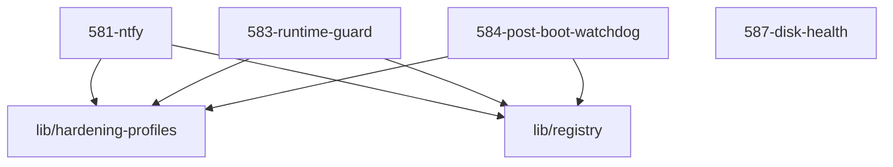

# LLM Wiki: `58-observability`

> **Zweck:** [BITTE MANUELL AUSFUELLEN: Wofuer ist dieser Ordner zustaendig?]

<!-- AUTO-GENERATED, DO NOT EDIT BELOW -->

## Module Map

| ID | Modul-Datei | Status | Komplexitaet | Ports |
|---|---|---|---|---|
| `581-ntfy` | `581-ntfy.nix` | active | 3/5 | - |
| `583-runtime-guard` | `583-runtime-guard.nix` | active | 3/5 | - |
| `584-post-boot-watchdog` | `584-post-boot-watchdog.nix` | active | 2/5 | - |
| `587-disk-health` | `587-disk-health.nix` | active | 2/5 | - |

## Interne Abhaengigkeiten (Requires)

Die Module in diesem Ordner benoetigen folgende Bibliotheken/Dateien:

- `lib/hardening-profiles`
- `lib/registry`

## Dependency Graph

---
*Generiert durch `medinix-meta.py generate-docs`*
